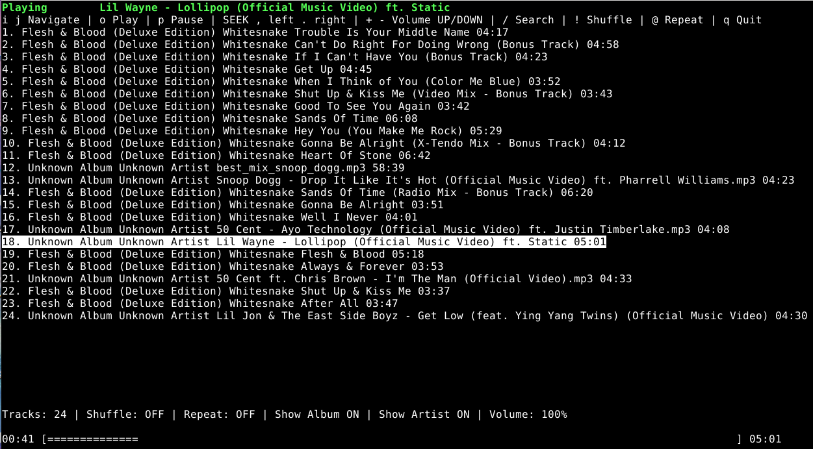

# 0verhau
ncurses music player similar to cmus

# Compile

```bash
make -j8  # 8 cores/threads to use in parallel compile
sudo/doas make install
```

# Requirements

In Debian it's `sudo apt install libncurses5-dev libncursesw5-dev libsfml-dev`, in your other OS's search for `lib ncurses  libsfml-dev`.

---

### keybinds

You can specify your own keybings (before starting **0verau**) in `$HOME/.0verau.conf` file:

```bash
# Default keybindings
UP=i
DOWN=j
PLAY=o
PAUSE=p
STOP=s
QUIT=q
REPEAT=r
SHUFFLE=h
SEARCH=/
VOLUMEUP=+
VOLUMEDOWN=-
SEEKLEFT=,
SEEKRIGHT=.
```

---

### Note

To search for specific song, quickly **double press** `/` and type it's name.

When you search for a song name and find it, make sure to erase the input with your backspace (above than Enter key), so the player to show the rest songs, after that press the **search** once to bring you the menu with the music.