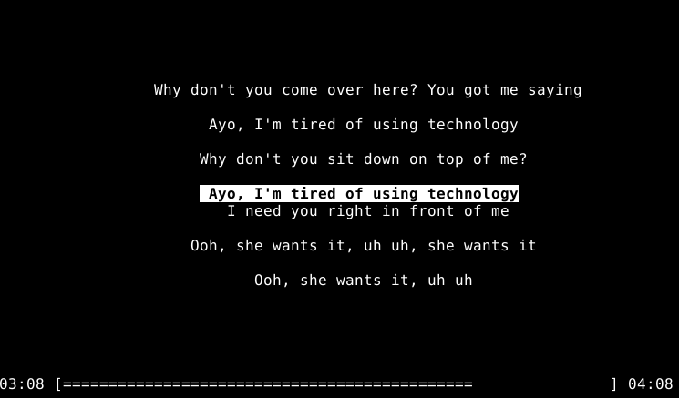

### Lyrics



# 0verau
ncurses music player similar to cmus

# Compile

```bash
make -j8  # 8 cores/threads to use in parallel compile
sudo/doas make install
```

# Requirements

In Debian it's `sudo apt install libncurses5-dev libncursesw5-dev libsfml-dev libtag1-dev libmpg123-dev`, in your other OS's search for `lib ncurses lib sfml lib tag lib mpg123`.

---

# keybinds

You can specify your own keybings (before starting **0verau**) in `$HOME/0verau.conf` file:

```bash
# Default keybindings
UP=i
DOWN=j
PLAY=o
PAUSE=p
QUIT=q
REPEAT=@
SHUFFLE=!
SEARCH=/
VOLUMEUP=+
VOLUMEDOWN=-
SEEKLEFT=,
SEEKRIGHT=.
SHOW_HIDE_ALBUM=$
SHOW_HIDE_ARTIST=#
SHOW_HIDE_LYRICS=%
```

---

### Note

To search for specific song, quickly **press** `/` and type a couple charaters of the requested music file. Note that **NOT** to type the charaters that control (keybindings) the music player.

When you search for a song name and find it, make sure to erase the input with your backspace (above than Enter key), after that press the **search** key once again to bring you to the menu with the song files.

The lyrics are harcoded to `song.lrc`, and I'm working on fetching from internet lyrics and saving them in a file, so the next time you play the same song to use this lyrics file.

If you can, please fetch the lyrics yourself and overwrite the `song.lrc` manually or with a script, sorry for the additional work that I'm requesting from you. Have a look at https://github.com/guxsousa/cmus-lyrics https://github.com/hakerdefo/cmus-lyrics for the parsing from scripts.

If you have some lyrics api to fetch from, you can adjust the `lyrics_fetcher.cpp` according to your needs.